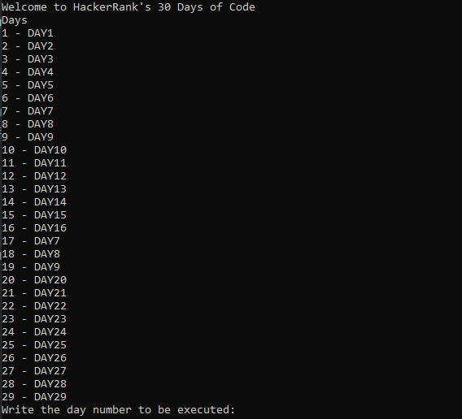

# HackerRank 30 Days Of Code
This is a C# dotnet core console project with all problems resolved from **HackerRank** - **30 days of code**  

Download the project and execute `dotnet run` in project root folder in the command line.

When you run the project, you can see the options list:

Enter the option number.

## .Net Core Version
**Ver:** 3.1 **[Download](https://dotnet.microsoft.com/download/dotnet-core/current/runtime)**
